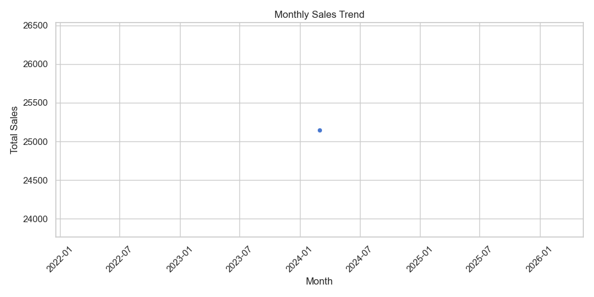
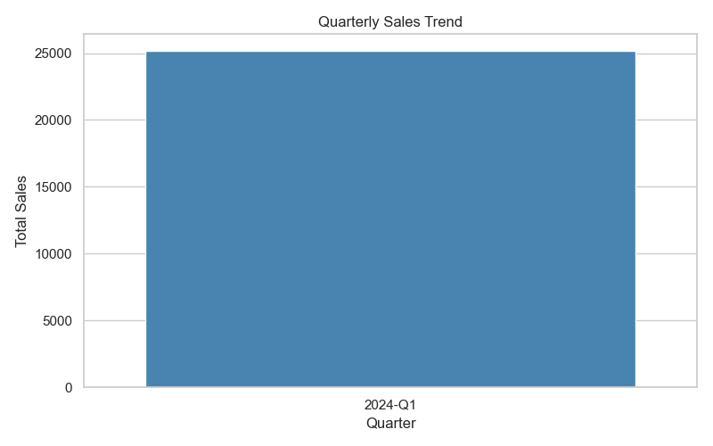
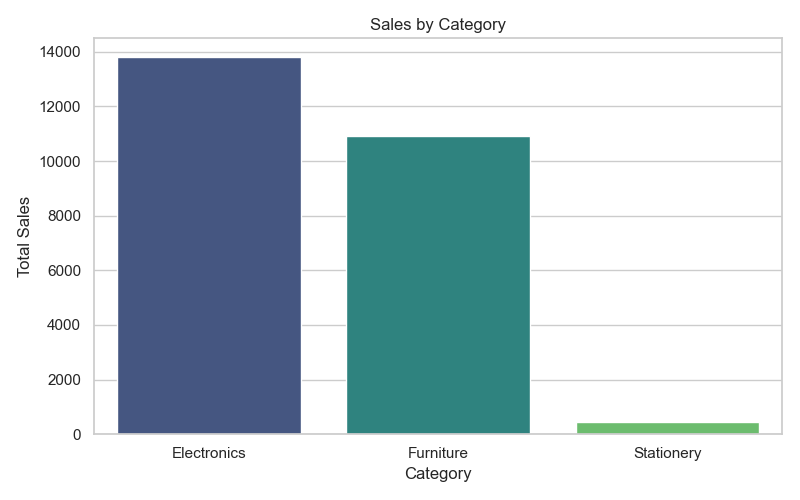
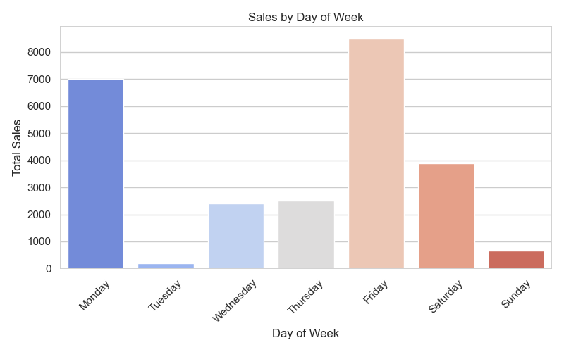

# 🛒 Sales Analysis Project


Welcome to the Sales Analysis Project!  
This project provides a complete analysis of sales data to uncover insights, trends, and patterns. It is designed to be a professional portfolio project showcasing skills in data cleaning, analysis, visualization, and reporting.

## 📊 Project Overview

- **Dataset:** `sales_data_v2.csv`  
- **Tools Used:** Python, Pandas, Matplotlib, Seaborn, Jupyter Notebook
- **Objectives:**
  - Clean and preprocess sales data
  - Analyze monthly and quarterly sales trends
  - Visualize sales by category, product, and day of the week
  - Generate professional visualizations and reports
  - Export insights and reports for business presentation

## 📂 Project Structure


## 🚀 Features

- 📅 **Monthly & Quarterly Sales Analysis**
- 🛍️ **Sales Breakdown by Category & Product**
- 📈 **Trend Visualizations for Better Insights**
- 📝 **Exported Sales Report (PDF & TXT)**
- 📊 **Feature-rich, Clean, and Professional Visualizations**

## 📸 Visualizations

Here are some examples of the visual outputs generated:

<p align="center">
  
  
</p>

<p align="center">
  
  
</p>

## 🧩 Requirements

Install the required libraries using:

```bash
pip install -r requirements.txt
📑 How to Run
Clone the repository:

bash
Copy
Edit
git clone https://github.com/Akashkc7/sales_analysis_project.git
Navigate to the project folder:

bash
Copy
Edit
cd sales_analysis_project
Install dependencies:

bash
Copy
Edit
pip install -r requirements.txt
Open the Jupyter Notebook and run the analysis:

bash
Copy
Edit
jupyter notebook notebooks/sales_analysis.ipynb
👤 About Me

**Name:** Akash K C

**Portfolio:** _Coming Soon_

**LinkedIn:** [Connect with me](https://www.linkedin.com/in/akash-k-c/)


🌟 Project Highlights
✅ Clean and organized code

✅ Professional-level visualizations

✅ Ready for portfolio presentation

✅ Exports and documentation included

📌 Future Improvements
Automate report generation

Add interactive dashboards (e.g., Plotly / Dash)

Integrate SQL analysis for advanced insights


